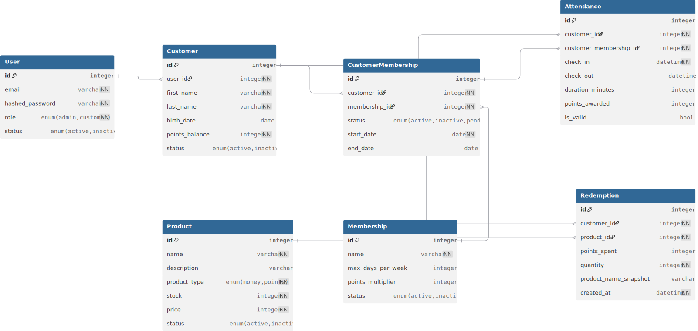

# 🏋️‍♂️ Gym Management API — FastAPI

**Gym Management API** es una API REST profesional desarrollada con **FastAPI** para gestionar clientes, membresías, asistencias, puntos y redenciones en un gimnasio o centro deportivo.

El proyecto está diseñado como un **backend real de producción**, aplicando arquitectura limpia, separación de responsabilidades, testing, autenticación y reglas de negocio claras.

> Este proyecto fue creado como práctica avanzada de backend para consolidar conocimientos en APIs, arquitectura y testing profesional.

---

## 🚀 Funcionalidades principales

### 👤 Gestión de usuarios y roles
- Registro y autenticación con JWT
- Roles: **ADMIN** y **CUSTOMER**
- Endpoints protegidos con dependencias
- Autorización por rol en rutas sensibles

---

### 🏷️ Membresías
- Crear y administrar planes de membresía
- Multiplicadores de puntos por plan
- Asignación de membresías a clientes
- Estados: activa, inactiva, pendiente
- Lógica de vencimiento y renovación

---

### 📅 Asistencias
- Check-in / check-out de clientes
- Control de asistencias diarias
- Prevención de check-in duplicado
- Cálculo automático de puntos
- Límites semanales configurables

---

### 🎁 Sistema de puntos y redenciones
- Acumulación de puntos por asistencia
- Catálogo de productos
- Redención validada por saldo disponible
- Descuento automático de puntos
- Registro de historial de redenciones

---


## 🧱 Arquitectura

El proyecto está organizado siguiendo principios de **Clean Architecture** y **Domain Driven Design**:

```text
app/
├── auth/
├── customers/
├── memberships/
├── customermemberships/
├── attendances/
├── redemptions/
├── shop/
├── core/
│   ├── config
│   ├── constants
│   ├── pagination
│   ├── database
│   ├── security
│   └── enums
├── conftest.py
├── helpers.py
└── main.py
```


### Separación clara de capas
- **routers** → API
- **services** → lógica de negocio
- **models** → dominio
- **schemas** → validación
- **dependencies** → autorización
- **tests** → validación de reglas reales

---

## 🧪 Testing

El proyecto cuenta con **tests automatizados para todos los módulos**:

- Autenticación y autorización
- Endpoints protegidos
- Reglas de negocio
- Casos límite (errores, duplicados, permisos)
- Fixtures reutilizables
- Base de datos de testing aislada

Ejecutar tests:

```bash
pytest
```

## 🔐 Seguridad

- JWT con expiración
- Hash de contraseñas (bcrypt)
- Protección de endpoints por rol
- Validación de payloads con Pydantic
- Prevención de operaciones inválidas

---

## 🛠️ Tecnologías utilizadas

- Python 3.12
- FastAPI
- SQLModel
- PostgreSQL / SQLite
- Alembic
- JWT
- Pydantic
- Pytest
- Uvicorn

---
## 🏗️ Instalación local

```bash
git clone https://github.com/tuusuario/gym-fastapi
cd gym-fastapi
python -m venv venv
source venv/bin/activate  # Windows: venv\Scripts\activate
pip install -r requirements.txt
pip install -r requirements-dev.txt
alembic upgrade head
uvicorn app.main:app --reload
```

## 📌 Estado del proyecto

- ✔ API completa
- ✔ Reglas de negocio implementadas
- ✔ Testing funcional
- ✔ Arquitectura escalable
- ✔ Lista para producción

---

## 🧩 Próximos pasos (roadmap)

- Dashboard frontend
- Webhooks (pagos, notificaciones)
- Integración con Stripe / MercadoPago
- Sistema multi-gym
- Background tasks
- Caching con Redis
- Observabilidad (logs, metrics)

---

## 👨‍💻 Autor

Proyecto desarrollado por **Geremias Arguello** como parte de su formación profesional en backend y APIs de producción.

📍 Enfocado en **Python Backend / FastAPI / Django / APIs REST**

## 🗄️ Database Diagram

El siguiente diagrama representa el modelo de dominio principal del sistema,
incluyendo la separación entre usuarios, clientes, contratos de membresía
y eventos históricos como asistencias y redenciones.

